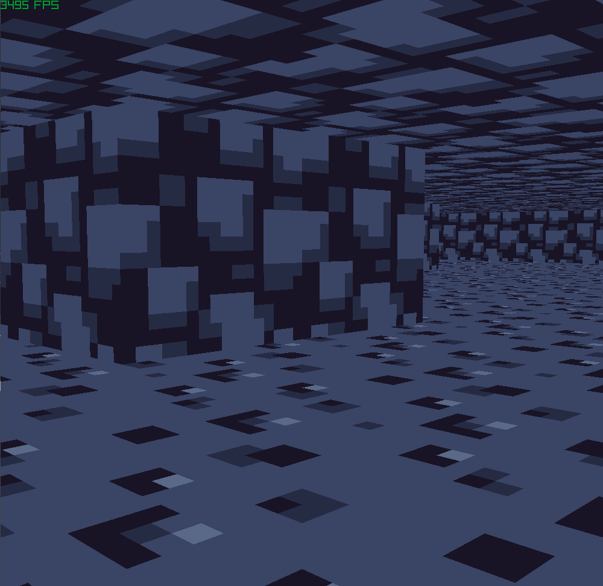

# Grappppling Hook Gun

## Description

In this project, I create a grappling hook gun. The player is able to left-click and deploy the grappling hook and swing around until disengaging using the right-click. The grappling hook slowly moves the player in the direction of where the grappling hook landed.

## Controls

WASD -> Movement
 Arrow Keys -> Rotation
 Left Shift -> Sprint

## Gallery

## How to Run

1. Clone the repository
2. Launch premake-VisualStudio.bat
3. Click on the solution file that was generated (grappling-hook-gun.sln, or parent-directory-name.sln)
4. Build and run project

## Tech Stack

Made using C++, raylib and git.

## Resources

[Pixel art textures](https://piiixl.itch.io/textures)
 [Crosshair](https://kenney-assets.itch.io/crosshair-pack)
